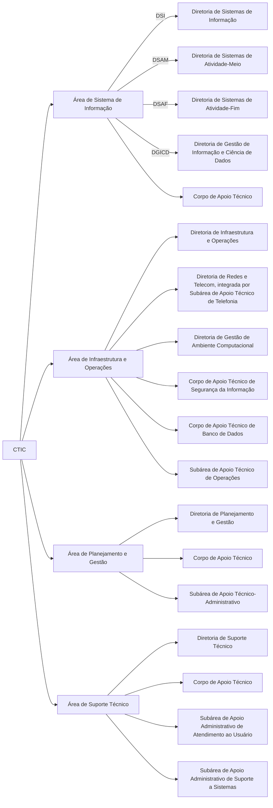

# Organograma

- [GitHub](https://github.com/my-ctic/organograma)

 

O presente repositório visa apresentar o organograma do CTIC, conforme [Resolução 1482/2022](./docs/2022.05.27%20-%20Resolu%C3%A7%C3%A3o%201482.pdf), além de aprender como montar diagramas usando o [**Mermaid**](https://mermaid.js.org/).

 

---

### Referências

- [**Mermaid Documentation**](https://mermaid.js.org/intro/)
- [Stackoverflow: **Spaces in Mermaid**](https://stackoverflow.com/questions/54311261/spaces-in-mermaid)
- [GitHub: **Include diagrams in your Markdown files with Mermaid**](https://github.blog/2022-02-14-include-diagrams-markdown-files-mermaid/)
- [Sec. Fazenda: hierarquia](http://www.fazenda.sp.gov.br/ua/hierarquia3.asp?ua1=0093022)

 

---

### Outros

- [Setor voltado à ciência de dados entra em funcionamento no CTIC](https://mpsp.mp.br/w/setor-voltado-%C3%A0-ci%C3%AAncia-de-dados-entra-em-funcionamento-no-ctic)
