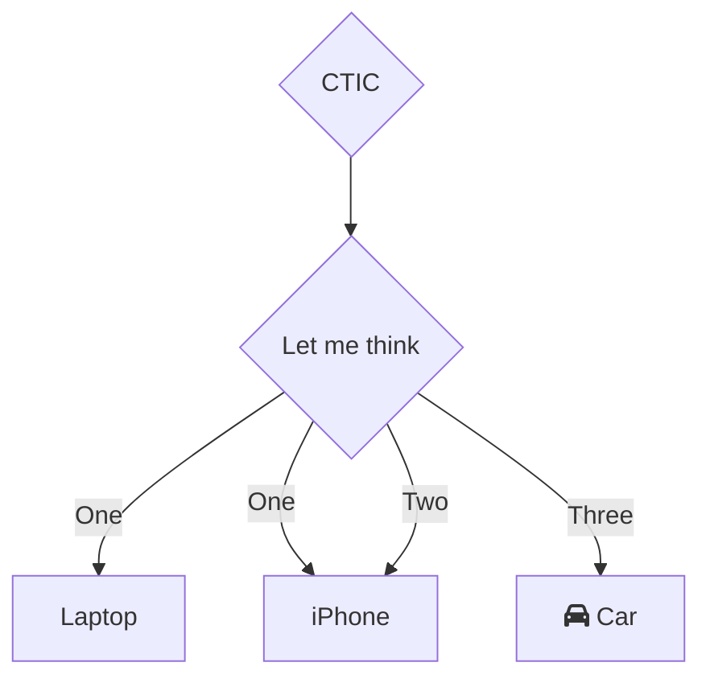
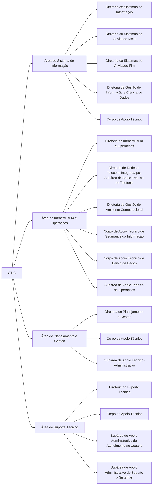

# Organograma

- [GitHub](https://github.com/mpsp-ctic/organograma)

<br>



```mermaid
graph TD
A|CTIC| --> C{Let me think}
C -->|One| D[Laptop]
C -->|One| E[Laptop]
C -->|Two| E[iPhone]
C -->|Three| F[fa:fa-car Car]
```



<br>

---

### Referências

- [**Mermaid**](https://mermaid.js.org/syntax/flowchart.html)
- [stackoverflow: **Spaces in Mermaid**](https://stackoverflow.com/questions/54311261/spaces-in-mermaid)
